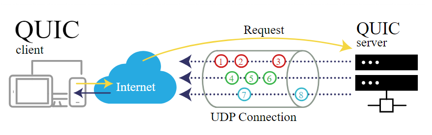
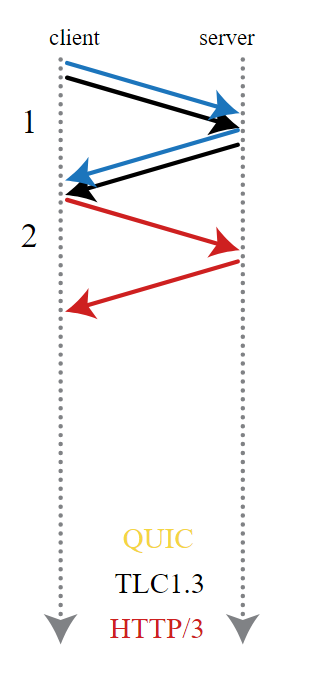

# 🌐 HTTP/2 & HTTP/3: The Evolution of Web Protocols

## 🚀 What is HTTP/2 and HTTP/3?

HTTP/2 and HTTP/3 are protocols that define how web browsers and servers communicate to exchange data efficiently.

- **HTTP/2 (2015)** improved performance over **HTTP/1.1** with features like:
  - 🌍 **Multiplexing** – multiple requests & responses can happen simultaneously.
  - 📦 **Header Compression** – reduces data size for faster transmission.
  - 📡 **Server Push** – sends essential resources before the client requests them.
  - 📊 **Priority-based Streaming** – optimizes loading order for better performance.

---

## 🔥 HTTP/3 – The Future of Web Communication

**HTTP/3 (developed since 2018)** is a revolutionary protocol that replaces TCP with **QUIC (Quick UDP Internet Connection)** to eliminate many limitations of HTTP/2.

- 🚫 **No Head-of-Line Blocking** – each request is handled independently.
- ⚡ **Faster Connections** – reduced latency and improved security.
- 🌍 **More Reliable Performance** – maintains robust connections even on unstable networks.

---

## 🎯 Key Benefits of HTTP/3 Over HTTP/2

1. **Uses QUIC (UDP-based protocol) instead of TCP.**
2. **Fewer Packets for Handshakes** – establishes connections faster.
3. **Resilience to Packet Loss**
   - UDP allows data to arrive out-of-order without blocking other streams.
4. **Independent Data Streams**
   - No bottlenecks, as different streams can operate without waiting for each other.
5. **Enhanced Security**
   - Each packet is encrypted individually.
6. **Quick Issue Resolution**
   - QUIC can rapidly address connection issues without waiting for timeouts.

---

## 📊 HTTP/3 in Action (Diagrams)

---

### ✨ Summary

HTTP/3 brings **speed, reliability, and security** to the web by leveraging **QUIC** instead of TCP. With reduced latency, independent streams, and enhanced encryption, it represents the future of high-performance web communication. 🚀
