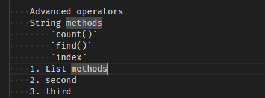
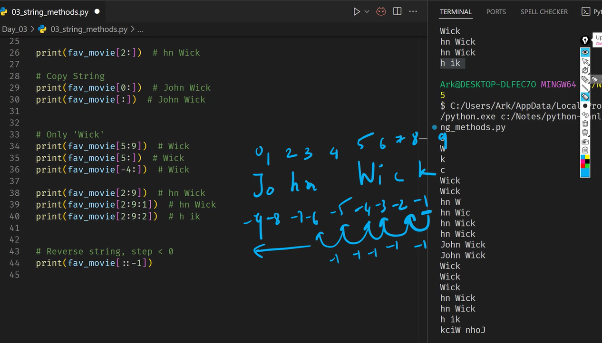

# HTTP/3

What it is:

It is a 3rd version of the HTTP used to exchange information on the web.

How it works:

1. Uses **QUIC** (Quick UDP Internet Connection) transport protocol (encapsulated inside UDP)
2. Uses fewer packets to establish connection (handshakes)
3. The connection is more resilient to packet loss
   1. Because it uses UDP, data doesn’t have to arrive in a specific order
4. Data integrity is the responsibility of the application layer
   1. Packets can arrive “out of order”, this won’t block other parts of data from being used (making it faster)
5. Different streams of data can work independently without waiting for each other.
6. Each packet is encrypted/decrypted independently
7. QUIC can quickly fix issues without waiting for a timeout

# Diagrams showing HTTP/3

