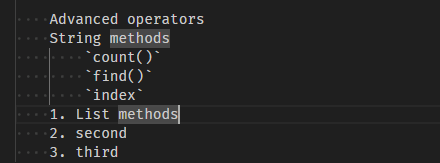
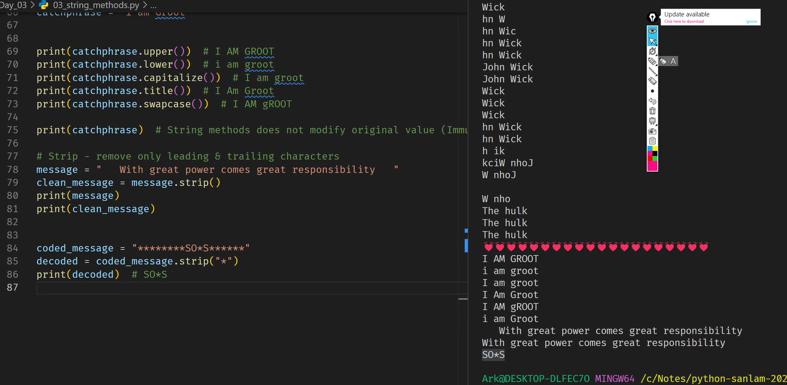

# Python Day 3

    Advanced operators

- String methods
  - `count()`
  - `find()`
  - `index`

1. List methods
2. second
3. third

## Shortcuts

    1. Alt + ⬆️ => for moving lines

```Py
area = PI * (rad**2)
print("Area of circle is: " + str(area))
Floor Division
```



https://getsharex.com/downloads

[Share X](https://getsharex.com/downloads)

##Table

| column 1 | Column 2 | column 3 |
| -------- | -------- | -------- |

| '//'

## `and`

- If any is `False` then `False`
- Only both `True` then `True`

``| Operator          |  Output |
| ----------------- | ------: |
|`True and True`  | `True`|
|` True and False`|`False`|
|`False and True` |`False`|
|`False and False`|`False` |

## `or`

- If any is `True` then `True`
- Only both `False` then `False`

| Operator         |  Output |
| ---------------- | ------: |
| `True or True`   |  `True` |
| ` True or False` |  `True` |
| `False or True`  |  `True` |
| `False or False` | `False` |



