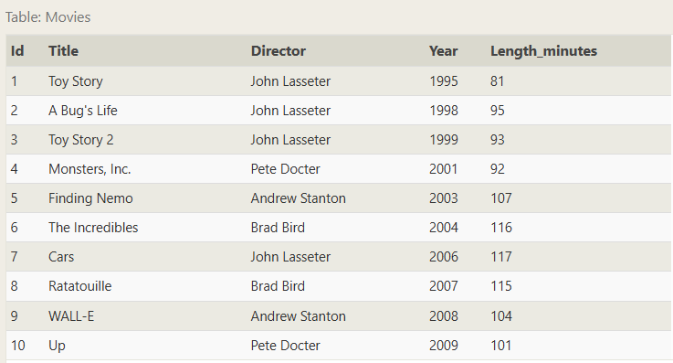
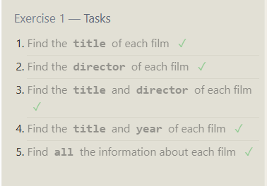
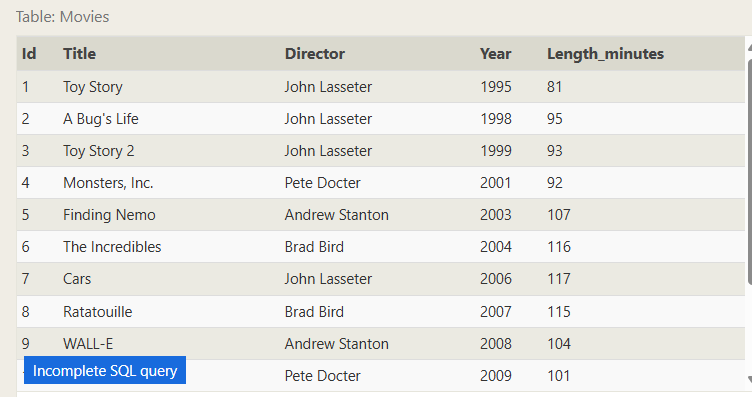
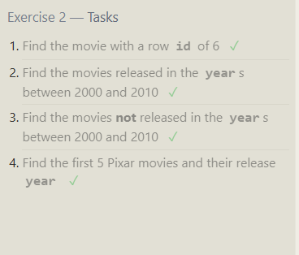
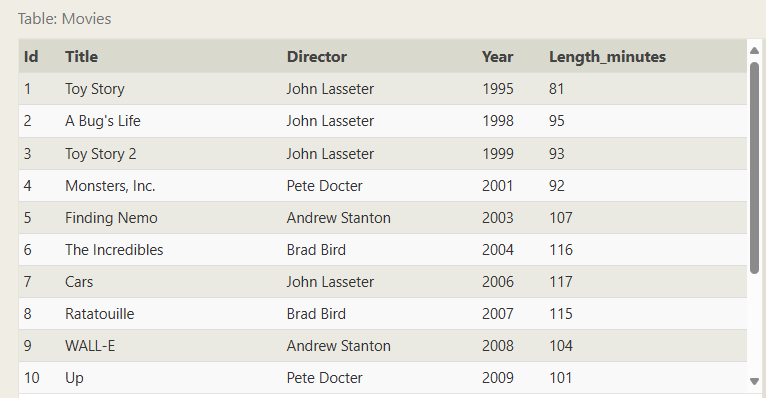
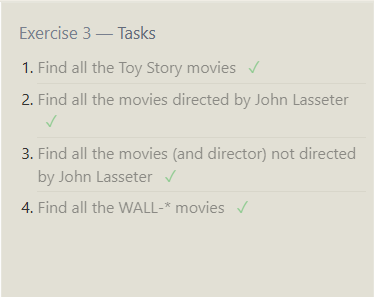
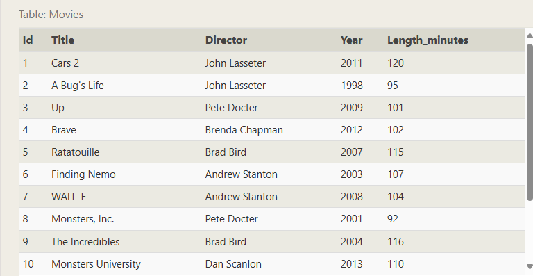
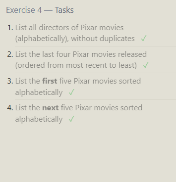
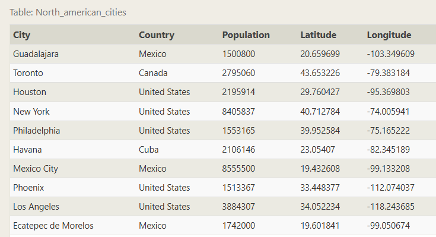
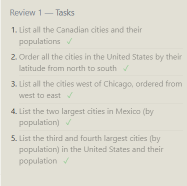

## Exercise 1.1



1.  Find the title of each film

    ```sql
    Select title
    FROM Movies;

    ```

2.  Find the director of each film
    ```sql
     Select director
     FROM Movies;
    ```
3.  Find the title and director of each film
    ```sql
     SELECT title,director
     FROM movies;
    ```
4.  Find the title and year of each film

    ```sql
     SELECT title,director
     FROM movies;

    ```

5.  Find all the information about each film
    ```sql
    SELECT \*
    FROM movies;

        ```

    

## Exercise 2



Find the movie with a row id of 6

```sql
    select * from movies
    where id=6;
```

Find the movies released in the years between 2000 and 2010 ✓

```sql
    select * from movies
    where year
    between 2000 and 2010;

```

Find the movies not released in the years between 2000 and 2010 ✓

```sql
    select * from movies
    where year
    not between 2000 and 2010;
```

Find the first 5 Pixar movies and their release year

```sql
    select * from movies
    where id
    between 1 and 5;

    SELECT * FROM movies limit 5;
```



## Exercise 3



Find all the Toy Story movies

```sql
SELECT * FROM movies where title like "toy story%";

```

Find all the movies directed by John Lasseter

```sql
    SELECT * FROM movies where Director like "john lasseter";
    SELECT * FROM movies where Director = "John Lasseter";

```

Find all the movies (and director) not directed by John Lasseter

```sql
SELECT * FROM movies where Director not like "John Lasseter";

```

Find all the WALL-\* movies

```sql
SELECT * FROM movies where title like "wal%";
SELECT * FROM movies where title like "wal___";

```



## Exercise 4



List all directors of Pixar movies (alphabetically), without duplicates

```sql
SELECT distinct director FROM movies order by director;

```

List the last four Pixar movies released (ordered from most recent to least)

```sql

select * from movies order by year desc limit 4;

```

List the first five Pixar movies sorted alphabetically

```sql

select * from movies order by title limit 5;
```

List the next five Pixar movies sorted alphabetically

```sql
select * from movies order by title limit 5 offset 5;

```



## Exercise 5



List all the Canadian cities and their populations ✓

```sql
SELECT city,population FROM north_american_cities where country like "canada";
```

Order all the cities in the United States by their latitude from north to south

```sql
SELECT * FROM north_american_cities where country like "united%"order by latitude desc;

```

List all the cities west of Chicago, ordered from west to east

```sql

SELECT city, longitude FROM north_american_cities
WHERE longitude < -87.629798
ORDER BY longitude ASC;

```

List the two largest cities in Mexico (by population)

```sql

select*from north_american_cities where country like"mexi%" order by population desc limit 2;

```

List the third and fourth largest cities (by population) in the United States and their population

```sql
select*from north_american_cities where country like"united%" order by population desc limit 2 offset 2;

```



## Exercise 6
