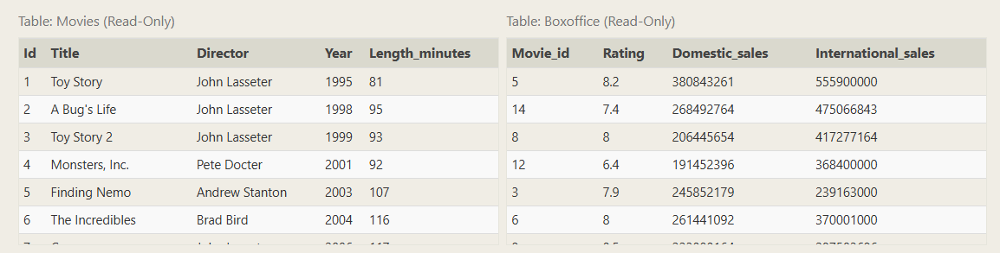
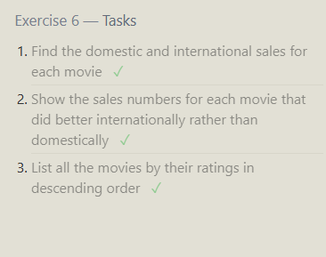
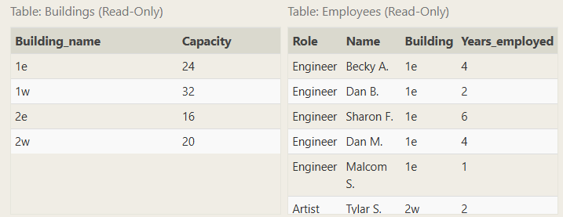

Find the domestic and international sales for each movie ✓

```sql
SELECT *
FROM Movies
INNER JOIN boxoffice
    ON id = movie_id;

```

Show the sales numbers for each movie that did better internationally rather than domestically

```sql
SELECT *
FROM Movies
INNER JOIN boxoffice
    ON id = movie_id
    where international_sales>domestic_sales;


```

List all the movies by their ratings in descending order

```sql
SELECT *
FROM Movies
INNER JOIN boxoffice
    ON id = movie_id
    order by rating desc;

```



## Exercise 7



Find the list of all buildings that have employees ✓

```sql
select distinct building from employees;

```

Find the list of all buildings and their capacity

```sql

select * from buildings
```

List all buildings and the distinct employee roles in each building (including empty buildings)

```sql
SELECT DISTINCT building_name, role
FROM buildings
  LEFT JOIN employees
    ON building_name = building;

```

---

8.2

SELECT DISTINCT building_name
FROM buildings
LEFT JOIN employees
ON building_name = building
WHERE role IS NULL;

---

9
9.1
select title, (domestic_sales + international_sales) / 1000000 as total_sales
from movies
JOIN boxoffice
ON movies.id = boxoffice.movie_id;

9.2
select title, (rating) \* 10 as Rating
FROM movies
JOIN boxoffice
ON movies.id = boxoffice.movie_id;

    -----------

11.2
SELECT role, COUNT(\*)
FROM employees
GROUP BY role;

11.3
